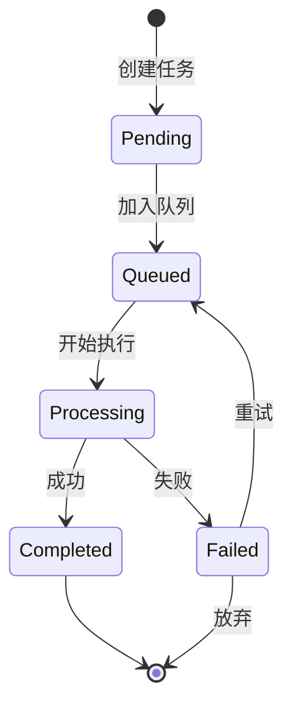

# 🔄 Translate Agent - 翻译工作流引擎

> AI Office 文档翻译任务编排和执行引擎

---

## 项目概述

`translate_agent` 是一个独立的翻译工作流引擎，用于管理和编排 AI Office 文档翻译任务。它解决了当前翻译系统缺乏任务编排、并发控制、进度跟踪和错误处理的问题。

### 核心特性

- ✅ **任务编排**: 多文件批量翻译、任务优先级队列、依赖关系管理
- ✅ **并发控制**: 限制并发任务数，防止 OOM
- ✅ **进度跟踪**: 实时进度（0-100%）、队列位置、预估剩余时间
- ✅ **错误处理**: 自动重试（指数退避）、错误分类、手动重试
- ✅ **质量评估**: 翻译前后对比、置信度评分、人工审核接口

---

## 技术栈

- **Python**: 3.10+
- **任务队列**: asyncio.Queue + SQLite
- **状态管理**: 状态机（Pending → Processing → Completed/Failed）
- **API**: FastAPI
- **数据库**: SQLite（可升级到 PostgreSQL）
- **前端**: Gradio（复用现有 UI）

---

## 项目结构

```
translate_agent/
├── app/
│   ├── api/              # API 路由
│   │   ├── __init__.py
│   │   ├── tasks.py      # 任务管理 API
│   │   └── status.py     # 状态查询 API
│   │
│   ├── core/             # 核心引擎
│   │   ├── __init__.py
│   │   ├── engine.py     # 工作流引擎
│   │   ├── scheduler.py  # 任务调度器
│   │   ├── queue.py      # 任务队列
│   │   └── state_machine.py  # 状态机
│   │
│   ├── models/           # 数据模型
│   │   ├── __init__.py
│   │   ├── task.py       # 任务模型
│   │   └── workflow.py   # 工作流模型
│   │
│   ├── services/         # 翻译服务
│   │   ├── __init__.py
│   │   ├── pptx_translator.py
│   │   ├── docx_translator.py
│   │   ├── xlsx_translator.py
│   │   └── pdf_translator.py
│   │
│   └── utils/            # 工具函数
│       ├── __init__.py
│       ├── db.py         # 数据库操作
│       └── retry.py      # 重试机制
│
├── tests/                # 测试
├── docs/                 # 文档
├── main.py               # 应用入口
└── requirements.txt      # 依赖
```

---

## 快速开始

### 安装依赖

```bash
cd translate_agent
pip install -r requirements.txt
```

### 启动服务

```bash
python main.py
```

### API 访问

- Swagger UI: http://localhost:8002/docs
- ReDoc: http://localhost:8002/redoc

---

## API 接口

### 任务管理

#### 1. 创建翻译任务
```http
POST /api/tasks
Content-Type: application/json

{
  "file_path": "/path/to/file.pptx",
  "file_type": "pptx",
  "target_language": "English",
  "model": "gpt-4o-mini",
  "priority": 5
}
```

#### 2. 批量创建任务
```http
POST /api/tasks/batch
Content-Type: application/json

{
  "tasks": [
    {"file_path": "/path/to/file1.pptx", "file_type": "pptx", ...},
    {"file_path": "/path/to/file2.docx", "file_type": "docx", ...}
  ]
}
```

#### 3. 查询任务状态
```http
GET /api/tasks/{task_id}
```

#### 4. 重试失败任务
```http
POST /api/tasks/{task_id}/retry
```

#### 5. 取消任务
```http
DELETE /api/tasks/{task_id}
```

### 工作流管理

#### 1. 创建工作流
```http
POST /api/workflows
Content-Type: application/json

{
  "name": "批量翻译项目 A",
  "tasks": [
    {"file_path": "file1.pptx", "depends_on": []},
    {"file_path": "file2.docx", "depends_on": ["file1.pptx"]}
  ]
}
```

#### 2. 查询工作流状态
```http
GET /api/workflows/{workflow_id}
```

---

## 使用示例

### Python SDK

```python
from translate_agent import TranslationEngine

# 初始化引擎
engine = TranslationEngine(
    max_concurrent_tasks=3,
    db_path="tasks.db"
)

# 创建任务
task = await engine.create_task(
    file_path="presentation.pptx",
    file_type="pptx",
    target_language="English",
    model="gpt-4o-mini",
    priority=5
)

# 查询状态
status = await engine.get_task_status(task.id)
print(f"Progress: {status.progress}%")

# 等待完成
result = await engine.wait_for_task(task.id)
print(f"Output: {result.output_path}")
```

---

## 状态机



---

## 配置

### 环境变量

```bash
# 数据库
DATABASE_URL=sqlite:///./tasks.db

# 并发控制
MAX_CONCURRENT_TASKS=3
QUEUE_SIZE=100

# 重试配置
MAX_RETRIES=3
RETRY_DELAY=1  # 秒
RETRY_BACKOFF=2  # 指数退避

# API
API_HOST=0.0.0.0
API_PORT=8002
```

---

## 待办事项

- [ ] 核心引擎实现
- [ ] 任务调度器
- [ ] 状态机
- [ ] API 接口
- [ ] 前端集成
- [ ] 测试用例
- [ ] 文档完善

---

## 许可证

MIT

---

**作者**: RongYe.Liu
**最后更新**: 2026-02-04
